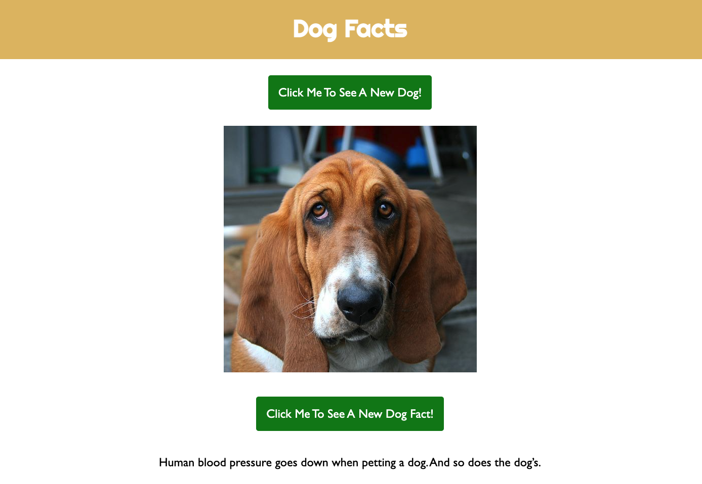

# Dog Facts
A fun website to generate random dog facts using HTML, CSS, JavaScript and the dog.ceo API

## Description
A simple webpage designed to allow users to generate a random dog image followed by another randomly generated fact about dogs. 
The dog image is rendered using simple JavaScript and an API fetch to the dog.ceo API (https://dog.ceo/dog-api/).

## Screenshot

